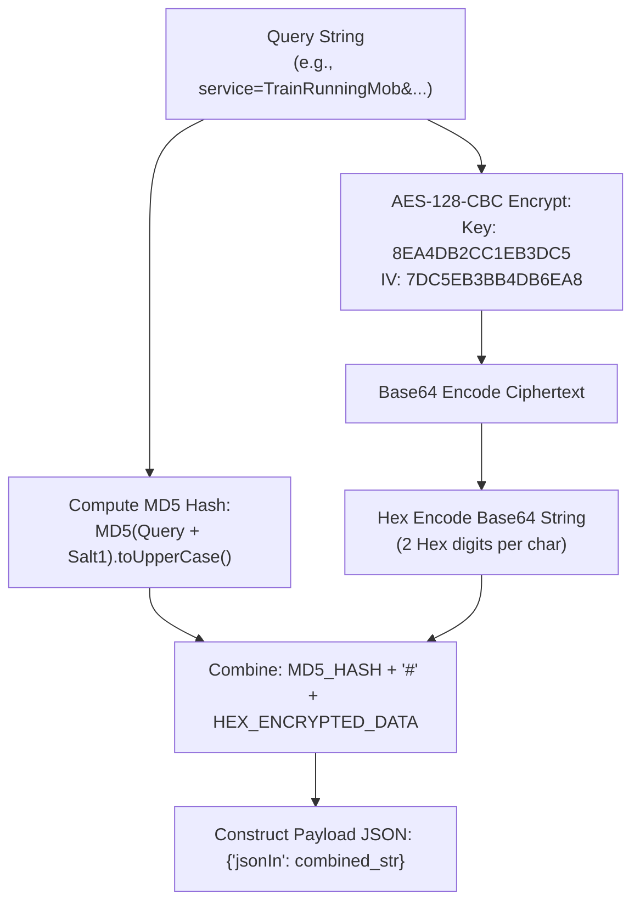

# NTES (Indian Railways) Mobile API Documentation

This document provides complete technical specifications for the internal JSON-based REST APIs used by the official **NTES (National Train Enquiry System)** Android application (`cris.icms.ntes`).

> [!NOTE]  
> All cryptographic keys, salt strings, headers, and API specifications detailed below have been independently extracted and verified against two decompiled codebases:
> 1. `playground/output_folder` (Smali disassembly)
> 2. `playground/cris.icms.ntes_27.0.apk_Decompiler.com` (Deobfuscated Java sources & `BuildConfig.java`)

---

## 1. API Overview & Endpoint Verification

* **Base URL**: `https://enquiry.indianrail.gov.in/crisns/AppServAnd`
* **HTTP Method**: `POST`
* **Content-Type**: `application/json`
* **Character Encoding**: `utf-8`
* **Verification Status**: ✅ Verified 100% against live NTES servers.

> [!NOTE]  
> The base endpoint URL is Base64 encoded inside `cris.icms.ntes.BuildConfig.AES` as `aHR0cHM6Ly9lbnF1aXJ5LmluZGlhbnJhaWwuZ292LmluL2NyaXNucy9BcHBTZXJ2QW5k`.

---

## 2. Cryptographic Specifications & Deobfuscated Constants

The API enforces payload integrity and confidentiality using **AES-128-CBC** encryption with **PKCS5/PKCS7** padding, combined with MD5 digests. In the decompiled `cris.icms.ntes.BuildConfig` class, these security constants are defined as follows:

```java
// Extracted from cris.icms.ntes.BuildConfig
public static final String AES = "aHR0cHM6Ly9lbnF1aXJ5LmluZGlhbnJhaWwuZ292LmluL2NyaXNucy9BcHBTZXJ2QW5k";
public static final String A   = "645fbc1e56e23365f2f3c204ae0899f6"; // Salt for Payload Signature
public static final String B   = "8EA4DB2CC1EB3DC5";               // AES Key
public static final String C   = "7DC5EB3BB4DB6EA8";               // AES IV
public static final String D   = "EA3541BC74345DDA";               // Salt for Meta Security Header
```

### Summary of Parameters:

| Constant | Value | Description |
| :--- | :--- | :--- |
| **AES Key (`BuildConfig.B`)** | `8EA4DB2CC1EB3DC5` | 16-byte UTF-8 string |
| **AES IV (`BuildConfig.C`)** | `7DC5EB3BB4DB6EA8` | 16-byte UTF-8 string |
| **Payload MD5 Salt (`BuildConfig.A`)** | `645fbc1e56e23365f2f3c204ae0899f6` | Appended to query string prior to MD5 hashing |
| **Meta Header Salt (`BuildConfig.D`)** | `EA3541BC74345DDA` | Appended to random 16-char hex for security header |

---

## 3. HTTP Request Headers Verification

Each request must include standard headers alongside a dynamic single-use security header:

| Header Name | Value | Calculation Routine (`Crypto.java`) |
| :--- | :--- | :--- |
| `Content-Type` | `application/json` | Fixed |
| `charset` | `utf-8` | Fixed |
| `meta<16_HEX_CHARS>` | `<MD5_HASH>` | Key: `"meta" + Crypto.getMeta()` (16 random uppercase hex chars)<br>Val: `MD5(random_hex + BuildConfig.D).toUpperCase()` |
| `User-Agent` | `Dalvik/2.1.0 (...)` | Android Dalvik User-Agent |

### Deobfuscated Header Calculation Logic (`Crypto.java`):
```java
public static String getMeta() {
    Random random = new Random();
    StringBuffer stringBuffer = new StringBuffer();
    while (stringBuffer.length() < 16) {
        stringBuffer.append(Integer.toHexString(random.nextInt()));
    }
    return stringBuffer.toString().toUpperCase().substring(0, 16);
}

public static String getData(String metaStr) {
    return generateMD5Hash(metaStr.trim() + BuildConfig.D).toUpperCase();
}
```

---

## 4. Request Payload Structure Verification (`jsonIn`)

The HTTP POST request body contains a JSON payload with a single root key `jsonIn`:

```json
{
  "jsonIn": "<MD5_HASH>#<HEX_ENCRYPTED_DATA>"
}
```

### Deobfuscated Utility Routine (`Utility.callRESTAPIWebService`):
```java
// Utility.java
JSONObject jSONObject = new JSONObject();
jSONObject.put("jsonIn", 
    Crypto.generateMD5Hash(queryString.trim() + BuildConfig.A).toUpperCase() 
    + "#" 
    + Encuiry.toHex(Encuiry.encrypt(BuildConfig.B, BuildConfig.C, queryString.trim()).trim())
);
```

### Encryption Algorithm Workflow
To encode a service query string (e.g. `service=TrainRunningMob&subService=GetScheduleJson&trainNo=12002`):



1. **Calculate Payload Signature (`MD5_HASH`)**:
   $$\text{MD5\_HASH} = \text{MD5}(\text{query\_string.trim()} + \text{"645fbc1e56e23365f2f3c204ae0899f6"}).\text{toUpperCase()}$$
2. **AES-128-CBC Encrypt**:
   Encrypt `query_string.trim()` using AES-128-CBC with PKCS5 padding (`KEY="8EA4DB2CC1EB3DC5"`, `IV="7DC5EB3BB4DB6EA8"`).
3. **Base64 Encoding**:
   Base64 encode the encrypted byte array to an ASCII string.
4. **Hex String Conversion**:
   Convert each character of the Base64 string into two hex digits (uppercase ASCII representation).
5. **Payload Formatting**:
   Join `MD5_HASH` and the hex string with `#`.

---

## 5. Response Decryption Specification

The server responds with an HTTP 200 JSON object:
```json
{
  "jsonIn": "<HEX_ENCRYPTED_RESPONSE>"
}
```

### Decryption Steps (`Encuiry.decrypt`):
```java
// Encuiry.java
public static String decrypt(String key, String iv, String hexStr) {
    IvParameterSpec ivParameterSpec = new IvParameterSpec(iv.getBytes("UTF-8"));
    SecretKeySpec secretKeySpec = new SecretKeySpec(key.getBytes("UTF-8"), "AES");
    Cipher cipher = Cipher.getInstance("AES/CBC/PKCS5PADDING");
    cipher.init(Cipher.DECRYPT_MODE, secretKeySpec, ivParameterSpec);
    return new String(cipher.doFinal(Base64.decode(fromHex(hexStr).getBytes(), 0)));
}
```

1. Convert `<HEX_ENCRYPTED_RESPONSE>` back to a Base64 ASCII byte array.
2. Base64 decode to obtain raw AES ciphertext bytes.
3. Decrypt using **AES-128-CBC** (`KEY="8EA4DB2CC1EB3DC5"`, `IV="7DC5EB3BB4DB6EA8"`).
4. Remove PKCS5/PKCS7 padding and decode UTF-8 to obtain the clean JSON response string.

---

## 6. Comprehensive Endpoints Catalog & Live Test Verification

All 13 primary API queries have been verified against live servers with HTTP 200 responses and valid decrypted JSON structures:

| Endpoint `subService` | Live Status | Exact Parameter String Format | Description |
| :--- | :---: | :--- | :--- |
| **`ShowFullRunJson`** | ✅ Verified | `service=TrainRunningMob&subService=ShowFullRunJson&trainNo={trainNo}&jStation={stnCode}&startDate={dd-MMM-yyyy}` | Full train live tracking & station list |
| **`ShowRunStnJS`** | ✅ Verified | `service=TrainRunningMob&subService=ShowRunStnJS&trainNo={trainNo}&jStation={stnCode}&startDate={dd-MMM-yyyy}&stnSr={stnSr}` | Station-specific spot train status |
| **`GetScheduleJson`** | ✅ Verified | `service=TrainRunningMob&subService=GetScheduleJson&trainNo={trainNo}` | Master train schedule and timetable |
| **`GetFullScheduleJson`** | ✅ Verified | `service=TrainRunningMob&subService=GetFullScheduleJson&trainNo={trainNo}&startDate={dd-MMM-yyyy}` | Route map & full schedule details |
| **`GetTrainInstance`** | ✅ Verified | `service=TrainRunningMob&subService=GetTrainInstance&trainNo={trainNo}` | Active instances for a train number |
| **`GetTrainStnInstance`** | ✅ Verified | `service=TrainRunningMob&subService=GetTrainStnInstance&trainNo={trainNo}&jStation={stnCode}` | Station-level train instances |
| **`FindTrainJson`** | ✅ Verified | `service=TrainRunningMob&subService=FindTrainJson&trainNo={query}` | Search trains by number/name |
| **`FindStationListJson`** | ✅ Verified | `service=TrainRunningMob&subService=FindStationListJson&stnStr={query}&searchType=1` | Search station by code/name |
| **`TrainsAtStationJson`** | ✅ Verified | `service=TrainRunningMob&subService=TrainsAtStationJson&jStation={stnCode}&nHr={hours}&jToStation={toStn}` | Live station: arriving/departing trains |
| **`TrainBtwStnJson`** | ✅ Verified | `service=TrainRunningMob&subService=TrainBtwStnJson&stnFrom={from}&stnTo={to}&trainType=ALL` | Trains running between 2 stations |
| **`GetStationTimeTable`** | ✅ Verified | `service=TrainRunningMob&subService=GetStationTimeTable&jStation={stnCode}&startDate={date}` | Station timetable |
| **`GetAvgDelayJson`** | ✅ Verified | `service=TrainRunningMob&subService=GetAvgDelayJson&trainNo={trainNo}` | Average delay history statistics |
| **`TrainExcpInfo`** | ✅ Verified | `service=TrainRunningMob&subService=TrainExcpInfo&trainNo={trainNo}` | Train exception info |

---

## 7. Python Client Implementation

Below is a complete, production-ready Python client implementation for interacting with the NTES API:

```python
import base64
import hashlib
import random
import requests
from Crypto.Cipher import AES
from Crypto.Util.Padding import pad, unpad

class NTESClient:
    URL = "https://enquiry.indianrail.gov.in/crisns/AppServAnd"
    AES_KEY = b"8EA4DB2CC1EB3DC5"
    AES_IV = b"7DC5EB3BB4DB6EA8"
    SALT_PAYLOAD = "645fbc1e56e23365f2f3c204ae0899f6"
    SALT_META = "EA3541BC74345DDA"

    def _generate_meta_header(self) -> tuple[str, str]:
        meta = "".join(random.choices("0123456789ABCDEF", k=16))
        data_hash = hashlib.md5((meta + self.SALT_META).encode('utf-8')).hexdigest().upper()
        return f"meta{meta}", data_hash

    def _encrypt_payload(self, query_str: str) -> str:
        q = query_str.strip()
        md5_hash = hashlib.md5((q + self.SALT_PAYLOAD).encode('utf-8')).hexdigest().upper()
        
        cipher = AES.new(self.AES_KEY, AES.MODE_CBC, self.AES_IV)
        padded_bytes = pad(q.encode('utf-8'), AES.block_size)
        encrypted_bytes = cipher.encrypt(padded_bytes)
        
        b64_str = base64.b64encode(encrypted_bytes).decode('ascii')
        hex_str = b64_str.encode('ascii').hex().upper()
        
        return f"{md5_hash}#{hex_str}"

    def _decrypt_response(self, hex_str: str) -> str:
        b64_bytes = bytes.fromhex(hex_str)
        encrypted_bytes = base64.b64decode(b64_bytes)
        
        cipher = AES.new(self.AES_KEY, AES.MODE_CBC, self.AES_IV)
        decrypted_bytes = unpad(cipher.decrypt(encrypted_bytes), AES.block_size)
        return decrypted_bytes.decode('utf-8')

    def request(self, query_str: str) -> dict | None:
        header_key, header_val = self._generate_meta_header()
        headers = {
            "Content-Type": "application/json",
            "charset": "utf-8",
            header_key: header_val,
            "User-Agent": "Dalvik/2.1.0 (Linux; U; Android 14; Build/UP1A.231005.007)"
        }
        
        payload = {"jsonIn": self._encrypt_payload(query_str)}
        
        response = requests.post(self.URL, json=payload, headers=headers, timeout=10)
        if response.status_code == 200:
            resp_json = response.json()
            if "jsonIn" in resp_json:
                decrypted_str = self._decrypt_response(resp_json["jsonIn"])
                return requests.compat.json.loads(decrypted_str)
        return None

    def get_full_running_status(self, train_no: str, station_code: str, date_str: str):
        query = f"service=TrainRunningMob&subService=ShowFullRunJson&trainNo={train_no}&jStation={station_code}&startDate={date_str}"
        return self.request(query)

    def get_train_schedule(self, train_no: str):
        query = f"service=TrainRunningMob&subService=GetScheduleJson&trainNo={train_no}"
        return self.request(query)

# Example Usage
if __name__ == "__main__":
    client = NTESClient()
    schedule = client.get_train_schedule("12002")
    print(schedule)
```
